# Laboratorio 1 Introducción MVN-GIT ARSW


## Empezando

>Para clonar el archivo 

git clone https://github.com/andresflorezp/ARSW-LAB1.git
>
### Prerrequisitos
* Maven
* Java
* Git


### Instalación

Despues de clonar el archivo para correrlo con:

* mvn package

## Construido con

* [Maven] (https://maven.apache.org/) - Gestión de dependencias

## Parte GIT

Como primer paso debemos crear el repositorio en github.

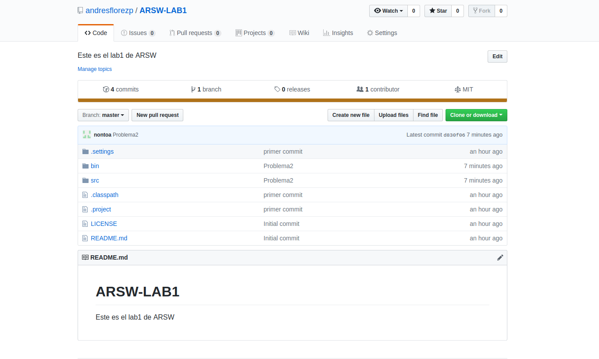

Luego de eso debemos hacer la configuracion basica de usuario,correo,y remote.

Los comandos son los siguientes:

* **git init-→Permite iniciar el repositorio**

* **git config –global user.name “nombre-del-usuaio”**

* **git config –global user.mail “correo-del-usuaio”**

* **git remote add origin https://github.com/nombre_user/name_repositorio.git**

En lo siguiente hacemos la configuracion:

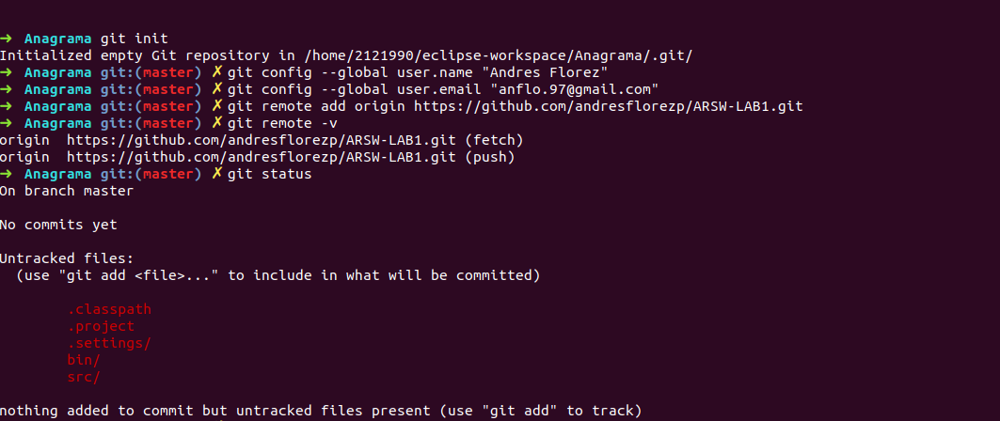

Si queremos añadir los archivos al repositorio local lo hacemos con 

       git add .

Para hacer un commit 

       git commit -m “Descripcion del commit”

Siguiendo con los problemas indicados el usuario 1, en este caso Andres Giovanne Florez Perez.

Mostramos lo que se realiza en el primer problema Antes que nada debemos traer de el repositorio remoto a donde estamos trabajando para que la rama se actualize para ello utilizamos 

       git pull –-rebase origin master

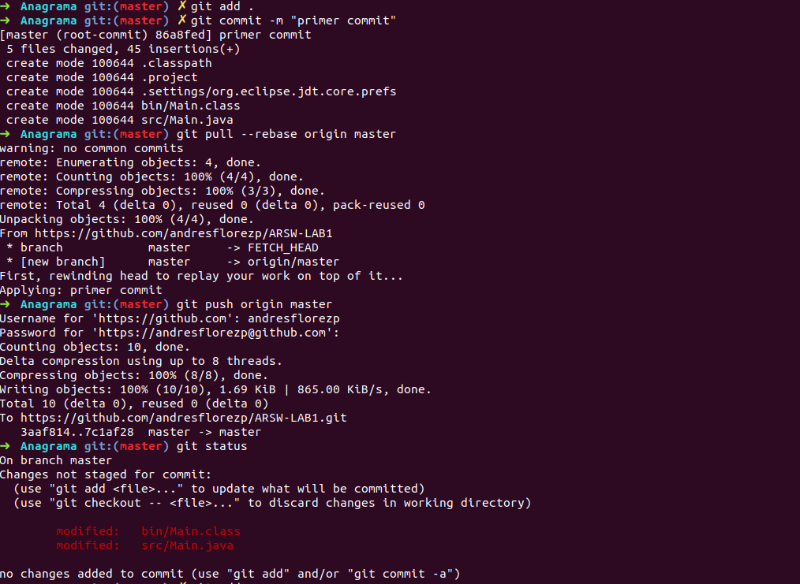

y luego seguimos los pasos mencionados anteriormente.

## Codificacion Anagrama

```java
import java.util.Scanner;

public class Anagram {

    public static boolean isAnagram(String a, String b) {
        char[] word1 = a.toLowerCase().toCharArray();
        char[] word2 = b.toLowerCase().toCharArray();
        sort(word1, 0, word1.length-1);
        sort(word2, 0, word2.length-1);
        if(word1.length != word2.length)return false;
        boolean flag = true;
        for (int i = 0; i < word1.length; i++) {
            if (word1[i] != word2[i])
                flag = false;
        }
        if (flag) {
            return true;
        } else {
            return false;
        }
    }
   static void merge(char arr[], int l, int m, int r) 
        { 
            // Find sizes of two subarrays to be merged 
            int n1 = m - l + 1; 
            int n2 = r - m; 
      
            /* Create temp arrays */
            char L[] = new char [n1]; 
            char R[] = new char [n2]; 
      
            /*Copy data to temp arrays*/
            for (int i=0; i<n1; ++i) 
                L[i] = arr[l + i]; 
            for (int j=0; j<n2; ++j) 
                R[j] = arr[m + 1+ j]; 
      
      
            /* Merge the temp arrays */
      
            // Initial indexes of first and second subarrays 
            int i = 0, j = 0; 
      
            // Initial index of merged subarry array 
            int k = l; 
            while (i < n1 && j < n2) 
            { 
                if (L[i] <= R[j]) 
                { 
                    arr[k] = L[i]; 
                    i++; 
                } 
                else
                { 
                    arr[k] = R[j]; 
                    j++; 
                } 
                k++; 
            } 
      
            /* Copy remaining elements of L[] if any */
            while (i < n1) 
            { 
                arr[k] = L[i]; 
                i++; 
                k++; 
            } 
      
            /* Copy remaining elements of R[] if any */
            while (j < n2) 
            { 
                arr[k] = R[j]; 
                j++; 
                k++; 
            } 
        } 
      
        // Main function that sorts arr[l..r] using 
        // merge() 
        static void sort(char arr[], int l, int r) 
        { 
            if (l < r) 
            { 
                // Find the middle point 
                int m = (l+r)/2; 
      
                // Sort first and second halves 
                sort(arr, l, m); 
                sort(arr , m+1, r); 
      
                // Merge the sorted halves 
                merge(arr, l, m, r); 
            } 
        } 
  public static void main(String[] args) {
    
        Scanner scan = new Scanner(System.in);
        String a = scan.next();
        String b = scan.next();
        scan.close();
        boolean ret = isAnagram(a, b);
        System.out.println( (ret) ? "Anagrams" : "Not Anagrams" );
    }
}

}
```
> Para la solucion del anagrama  se ordenan las dos cadenas y se comparan si son iguales, si no son iguales no es un anagrama, si son iguales es un anagrama

Luego el usuario 1 hace

       push origin master
esto para subirlo al repositorio en github

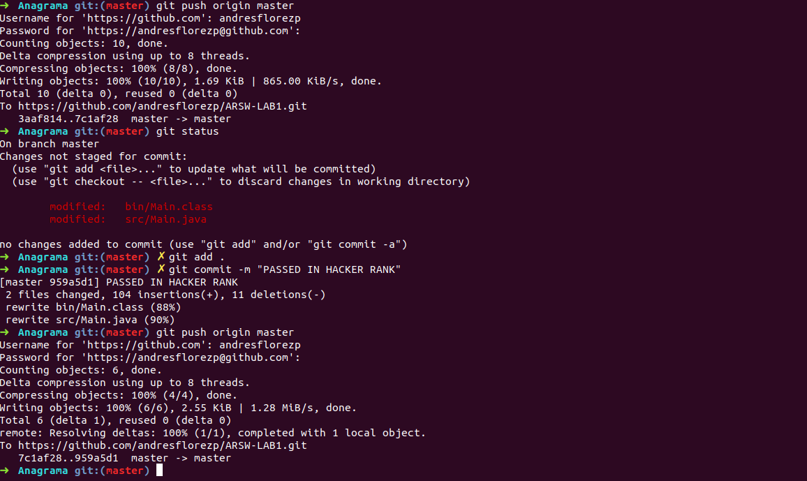

Para el primer problema mostramos que es aceptado en [**HackerRank**](https://www.hackerrank.com/challenges/java-anagrams/problem)

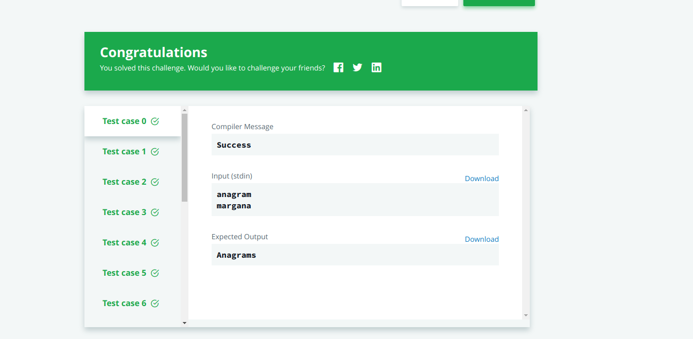

Luego el segundo compañero es decir Juan Nicolas Nontoa Caballero hace los comandos básicos de configuración de git es decir el user,email,remote. 

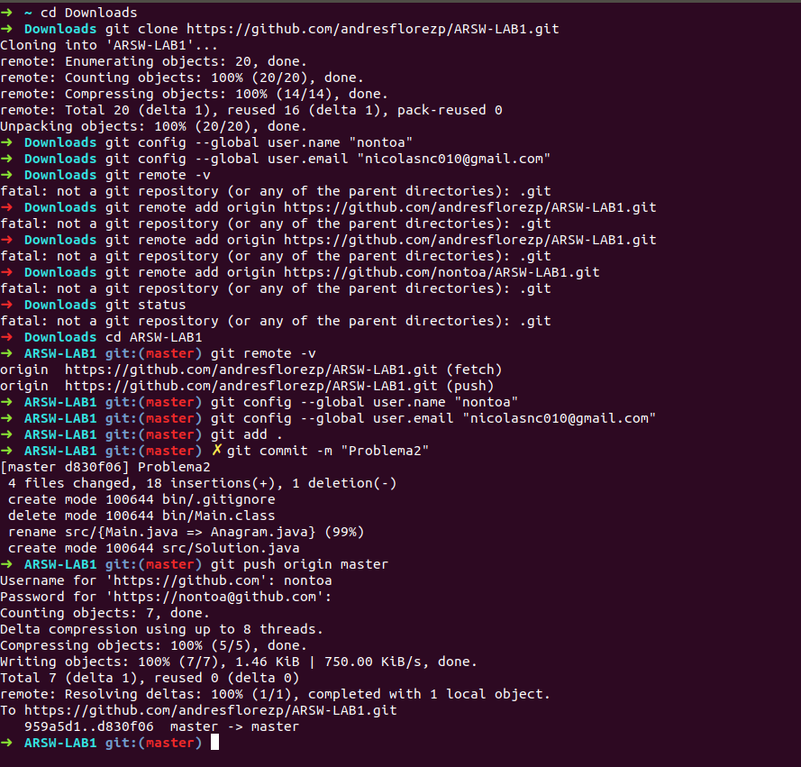

Antes que nada el usuario2 debe hacer

       git pull origin master
     

## Codificacion Problema EOF

``` java
import java.io.*;
import java.util.*;

public class Solution {

	public static void main(String[] args) {
		Scanner sc = new Scanner(System.in);
		int n=1;
		while(sc.hasNext()) {
			System.out.println(n + " " +sc.nextLine());
			n++;
		}
	}

}

```
luego de eso se realiza

       git push origin master

para subirlo al repositorio.

Ademas se muestra que el problema es aceptado en [**HackerRank**](https://www.hackerrank.com/challenges/java-end-of-file/problem)

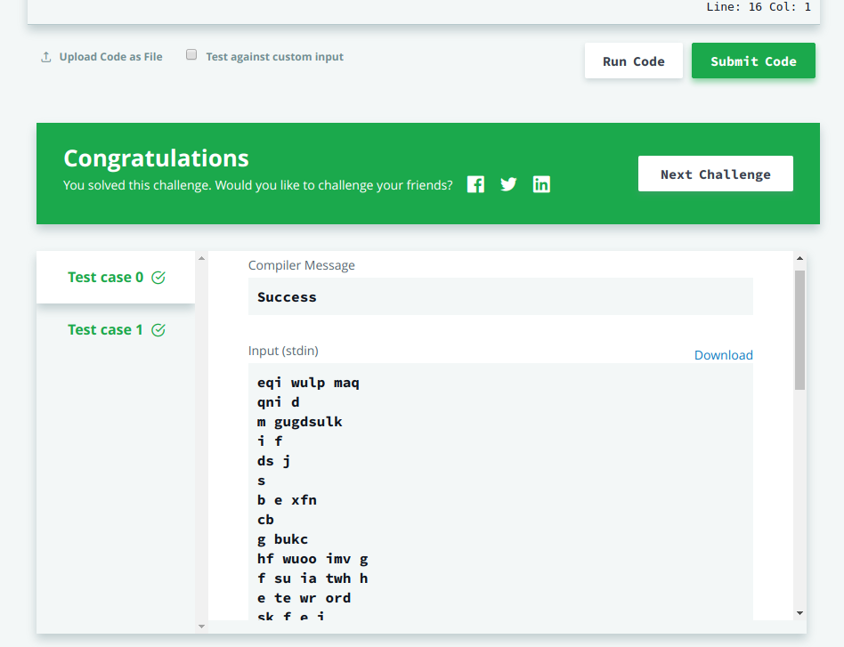

Luego hacemos git pull origin master para traer los cambios y por ultimo subir el reporte al github.

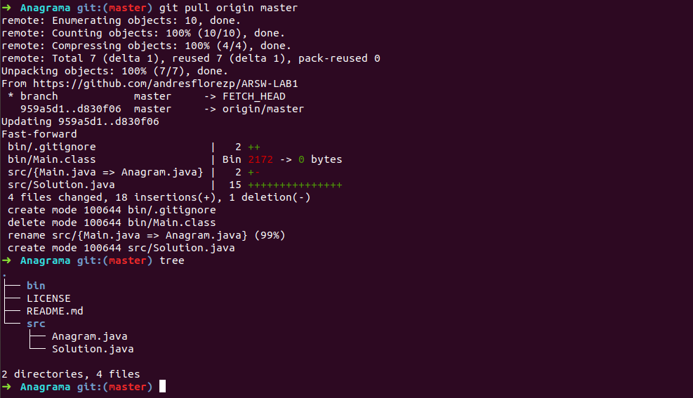

## Parte MAVEN
Antes que nada deberemos crear un projecto maven lo realizaremos con un arqueotipo.

       mvn archetype:generate -B -DgroupId=edu.eci -DartifactId=file-spy


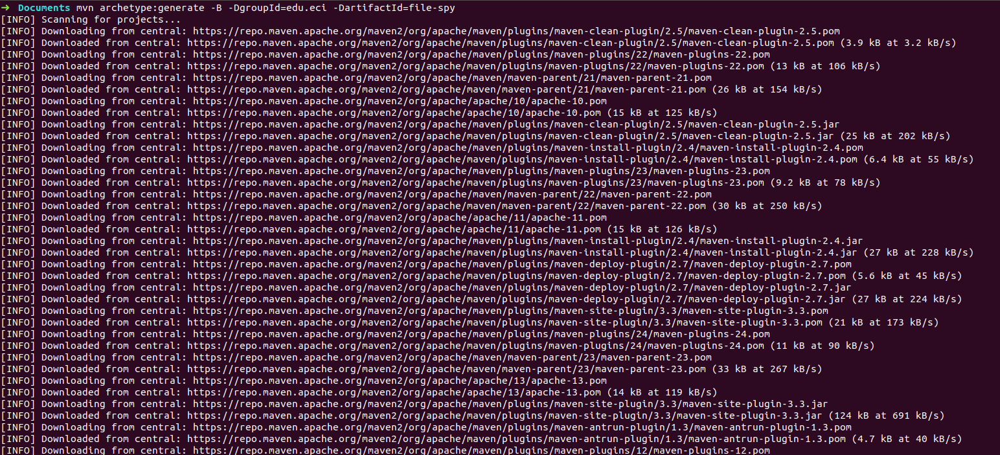
### Creando Projecto Maven
* ¿Qué significa la opción -B en el comando?
       
* ¿Qué significa la opción -D en el comando?

* ¿Qué significa las propiedades groupId, artifactId en el comando?

>  groupId es el identificador único de la organización o grupo que crea el proyecto (se podría decir que es el identificador de la aplicación), y artifactId es el identificador único del artefacto principal de este proyecto (se podría decir que es el identificador del módulo dentro de la aplicación), es decir, este será el nombre del jar.

* Describe el contenido del directorio que se ha creado.

> Se creo un proyecto el cual contiene el POM.xml y una carpeta src en la cual tiene dos carpetas, main y test.

``` 
my-app
|-- pom.xml
`-- src
    |-- main
    |   `-- java
    |       `-- edu
    |           `-- eci
    |               `-- FileSpy.java
    |                  
    `-- test
        `-- java
            `-- edu
                `-- eci
                    `-- AppTest.java

```

Al momento de compilarlo y empaquetarlo con

       mvn compile o mvn package

```
 
target
    ├── classes
    │   └── edu
    │       └── eci
    │           ├── FileSpy.class
    │           
    ├── file-spy-1.0-SNAPSHOT.jar
    ├── generated-sources
    │   └── annotations
    ├── generated-test-sources
    │   └── test-annotations
    ├── maven-archiver
    │   └── pom.properties
    ├── maven-status
    │   └── maven-compiler-plugin
    │       ├── compile
    │       │   └── default-compile
    │       │       ├── createdFiles.lst
    │       │       └── inputFiles.lst
    │       └── testCompile
    │           └── default-testCompile
    │               ├── createdFiles.lst
    │               └── inputFiles.lst
    ├── surefire-reports
    │   ├── TEST-edu.eci.AppTest.xml
    │   └── edu.eci.AppTest.txt
    └── test-classes
        └── edu
            └── eci
                └── AppTest.class

```
Se crea un carpeta target que contiene los .class

* Crear los directorios src/main/resources y src/test/resources

Luego de hacer la estructura queda de la siguiente forma

```
.
├── pom.xml
├── src
│   ├── main
│   │   └── java
│   │       └── edu
│   │           └── eci
│   │               ├── FileSpy.java
│   │               └── resources
│   │                
│   └── test
│       └── java
│           └── edu
│               └── eci
│                   └── AppTest.java
└── target
    ├── classes
    │   └── edu
    │       └── eci
    │           ├── FileSpy.class
    ├── file-spy-1.0-SNAPSHOT.jar
    ├── generated-sources
    │   └── annotations
    ├── generated-test-sources
    │   └── test-annotations
    ├── maven-archiver
    │   └── pom.properties
    ├── maven-status
    │   └── maven-compiler-plugin
    │       ├── compile
    │       │   └── default-compile
    │       │       ├── createdFiles.lst
    │       │       └── inputFiles.lst
    │       └── testCompile
    │           └── default-testCompile
    │               ├── createdFiles.lst
    │               └── inputFiles.lst
    ├── surefire-reports
    │   ├── TEST-edu.eci.AppTest.xml
    │   └── edu.eci.AppTest.txt
    └── test-classes
        └── edu
            └── eci
                └── AppTest.class


```
### Archivo Pom

* ¿Qué significa la palabra SNAPSHOT en el valor de la versión?

> Al indicar SNAPSHOT se quiere decir que es una versión evolutiva, es decir que estamos trabajando para obtener la versión 1.0.
       
* ¿Cuál es el propósito de la etiqueta de embalaje en el archivo POM?

>Con packaging se indica el tipo de empaquetado que hay que hacer con el proyecto. Podemos usar jar, war, ear, pom.

* ¿Cuál es el propósito de las dependencias y las etiquetas de dependencia en el archivo POM?

>El proposito de los tags es mantener una estructura ordenada y ademas permitir no estar cargando los jar de 
las librerias sino solo llamarlas cuando uno las necesite.

###  Administracion de Dependencias
pom.xml con todas las dependencias necesarias

``` xml
<project xmlns="http://maven.apache.org/POM/4.0.0" xmlns:xsi="http://www.w3.org/2001/XMLSchema-instance"
  xsi:schemaLocation="http://maven.apache.org/POM/4.0.0 http://maven.apache.org/maven-v4_0_0.xsd">
  <modelVersion>4.0.0</modelVersion>
  <groupId>edu.eci</groupId>
  <artifactId>file-spy</artifactId>
  <packaging>jar</packaging>
  <version>1.0-SNAPSHOT</version>
  <name>file-spy</name>
  <url>http://maven.apache.org</url>
  <properties>
  	<maven.compiler.source>1.8</maven.compiler.source>
  	<maven.compiler.target>1.8</maven.compiler.target>
  </properties>
  <dependencies>
    <dependency>
      <groupId>junit</groupId>
      <artifactId>junit</artifactId>
      <version>3.8.1</version>
      <scope>test</scope>
    </dependency>
     <dependency>
      <groupId>org.apache.tika</groupId>
      <artifactId>tika-core</artifactId>
      <version>1.20</version>
    </dependency>
  </dependencies>
   <build>
    <plugins>
        <plugin>
            <groupId>org.apache.maven.plugins</groupId>
            <artifactId>maven-compiler-plugin</artifactId>
            <configuration>
                <source>1.8</source>
                <target>1.8</target>
            </configuration>
        </plugin>
    </plugins>
  </build>
</project>


```

* Remplazando el archivo App.java por FileSpy.java

``` java
package edu.eci;

import java.nio.file.*;
import org.apache.tika.Tika;
import static java.nio.file.StandardWatchEventKinds.ENTRY_CREATE;

public class FileSpy {
	private static final String FILE_TYPE = "text/csv";
	private static final String DIR_TO_WATCH = new java.io.File("").getAbsolutePath()+"/src/main/java/edu/eci/resources";
	public static void main(String[] args) throws Exception {
		Path dir = Paths.get(DIR_TO_WATCH);
        Tika tika = new Tika();
        WatchService watchService = FileSystems.getDefault().newWatchService();
        dir.register(watchService, ENTRY_CREATE);
        WatchKey key;
        do {
            key = watchService.take();
            key.pollEvents().stream().filter(e -> {
                Path filename = (Path) e.context();
                String type = tika.detect(filename.toString());
                return FILE_TYPE.equals(type);
            }).forEach(e ->
                    System.out.printf("File found: %s%n", e.context())
            );
        } while (key.reset());
    }
}


```
> Nota:
Cabe resaltar que se cambio la ruta del directorio para que funcione en cualquier computador

* ¿Cual es la funcionalidad de la clase?
> Esta clase tiene la funcion de buscar archivos con una extension especifica en este caso archivos con extension .csv este lo hace en la carpeta donde se le especifique.

### Ciclos de vida de construccion y plugins

* Los tres principales ciclos de vida de Maven son clean, default y site. Describe cada uno de ellos.

>Clean Elimina todos los .class y .jar generados. Después de este comando se puede comenzar un compilado desde cero.
>>Site  Genera un sitio web con la información de nuestro proyecto. Dicha información debe escribirse en el fichero pom.xml y ficheros .apt separados. 
>>>Default no existe como comando de maven.

* Utilizando el terminal ejecuta el comando mvn compile. ¿Para qué se usa este comando? ¿Qué son las dependencias transitivas?

>Compila el codigo fuente del proyecto y sigue la fase de tests.

#### Proyecto maven creado
 

* Utilizando el terminal ejecuta el comando mvn package. ¿Para qué se usa este comando?

> Toma el codigo compilado y empaquetarlo en su formato distribuible, como un JAR.
       
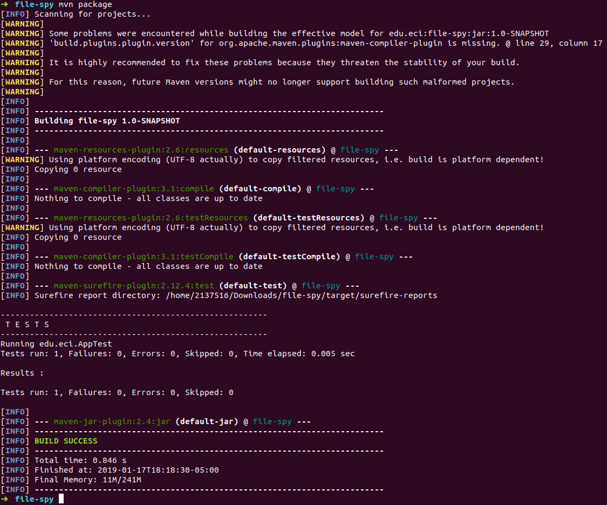

* Utilizando el terminal ejecuta el comando mvn install. ¿Para qué se usa este comando?

> Instalar el paquete en el repositorio local, para su uso como una dependencia en otros proyectos a nivel local.
       
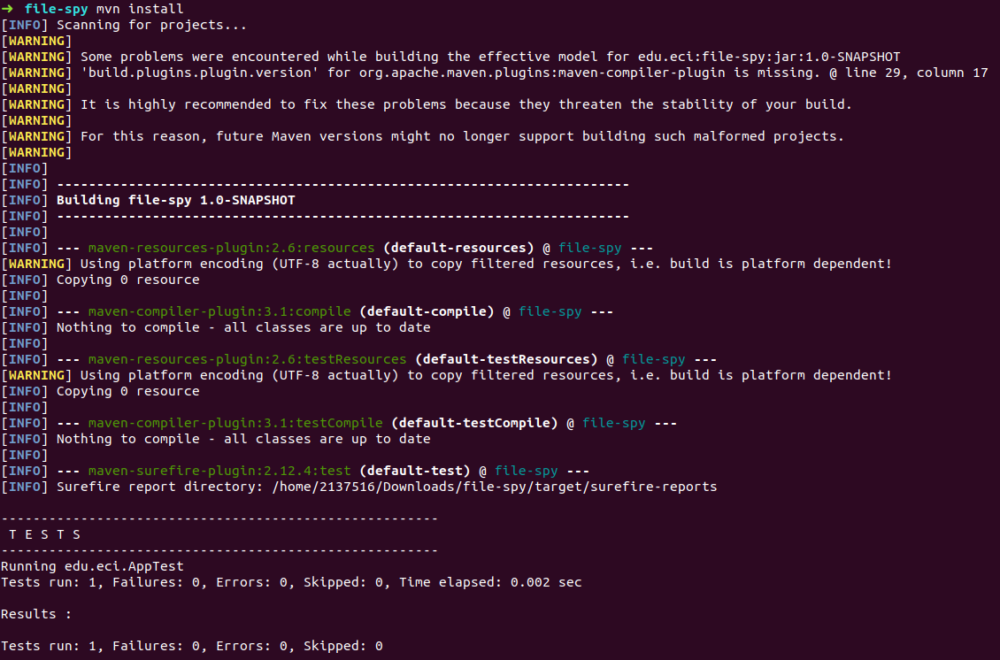

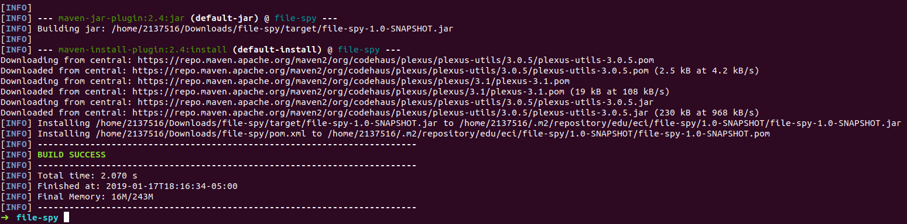

* Generar un nuevo proyecto de Maven en otra carpeta usando las herramientas de la línea de comandos de maven, este proyecto debe tener como id de grupo "edu.eci" y como artifactId "otro proyecto de maven".

> Luego de haber hecho el arqueotipo y compilarlo la estructura queda de la siguiente forma

```
.
├── pom.xml
├── src
│   ├── main
│   │   └── java
│   │       └── edu
│   │           └── eci
│   │               └── App.java
│   └── test
│       └── java
│           └── edu
│               └── eci
│                   └── AppTest.java
└── target
    ├── another-maven-project-1.0-SNAPSHOT.jar
    ├── classes
    │   └── edu
    │       └── eci
    │           └── App.class
    ├── generated-sources
    │   └── annotations
    ├── generated-test-sources
    │   └── test-annotations
    ├── maven-archiver
    │   └── pom.properties
    ├── maven-status
    │   └── maven-compiler-plugin
    │       ├── compile
    │       │   └── default-compile
    │       │       ├── createdFiles.lst
    │       │       └── inputFiles.lst
    │       └── testCompile
    │           └── default-testCompile
    │               ├── createdFiles.lst
    │               └── inputFiles.lst
    ├── surefire-reports
    │   ├── TEST-edu.eci.AppTest.xml
    │   └── edu.eci.AppTest.txt
    └── test-classes
        └── edu
            └── eci
                └── AppTest.class

```

* Reemplace el código de la clase App.java con el siguiente código y realice todos los pasos necesarios para compilar el código.

> Codigo que fue remplazado 

``` java
package edu.eci;

import edu.eci.FileSpy;

public class App 
{
    public static void main( String[] args )throws Exception
    {
        FileSpy.main(args);
    }
}
```

* Ahora enlazaremos el proyecto maven another-maven-project con file-spy

> Nota: Para ello añadiremos una dependencia en la cual sea ese proyecto es decir en anoter-maven-project se añadira la dependencia en el pom.xml y especificando la direccion con systempath

``` xml
 <dependency>
       <groupId>edu.eci</groupId>
    	<artifactId>file-spy</artifactId>
    	<version>1.0-SNAPSHOT</version>
    	<scope>system</scope>
    	<systemPath>${basedir}/../file-spy/target/file-spy-1.0-SNAPSHOT.jar</systemPath>
</dependency>

```
* Corriendo la aplicacion 

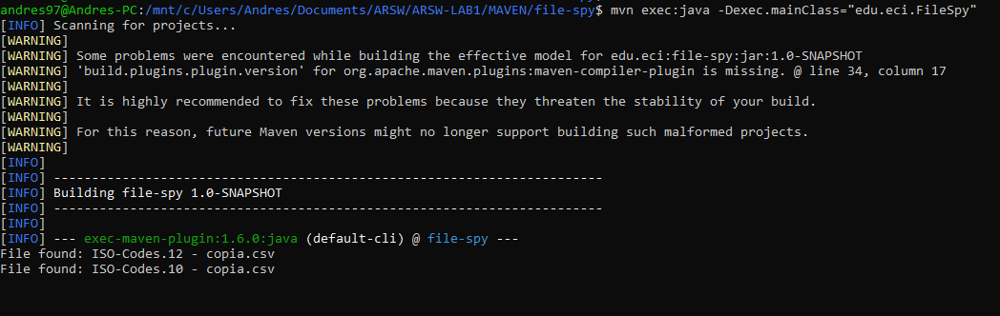

Y se nota como encuentra los archivo .csv


## Autores

* **Andres Giovanne Florez Perez**  ARSW-LAB1 - [andresflorezp] (https://github.com/andresflorezp)

* **Juan Nicolas Nontoa Caballero**  ARSW-LAB1 - [nontoa] (https://github.com/nontoa)

Consulte también la lista de [colaboradores] (https://github.com/andresflorezp/ARSW-LAB1/graphs/contributors) que participaron en este proyecto.

## licencia

Este proyecto está licenciado bajo la Licencia MIT - vea el archivo [LICENSE](LICENSE) para más detalles.

