# Laboratorio 1 Introducción MVN-GIT ARSW

## Empezando

>Para clonar el archivo 

git clone https://github.com/andresflorezp/ARSW-LAB1.git
>
### Prerrequisitos
* Maven
* Java
* Git

### Instalación

Despues de clonar el archivo para correrlo con:

* mvn package

## Construido con

* [Maven] (https://maven.apache.org/) - Gestión de dependencias

## Parte GIT

Como primer paso debemos crear el repositorio en github.

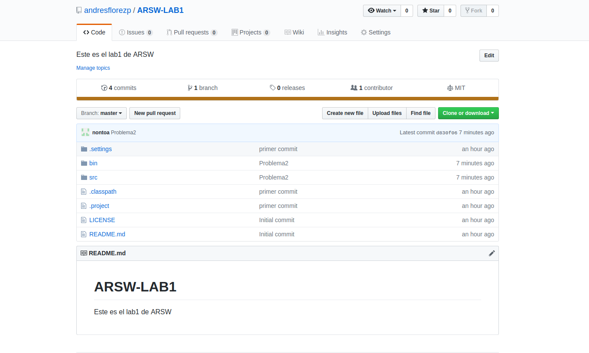

Luego de eso debemos hacer la configuracion basica de usuario,correo,y remote.

Los comandos son los siguientes:

* **git init-→Permite iniciar el repositorio**

* **git config –global user.name “nombre-del-usuaio”**

* **git config –global user.mail “correo-del-usuaio”**

* **git remote add origin https://github.com/nombre_user/name_repositorio.git**

En lo siguiente hacemos la configuracion:

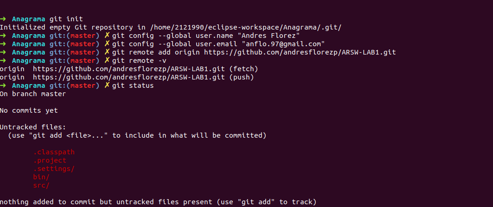

Si queremos añadir los archivos al repositorio local lo hacemos con **git add .** Para hacer un commit **git commit -m “Descripcion del commit”**.

Siguiendo con los problemas indicados el usuario 1, en este caso Andres Giovanne Florez Perez.

Mostramos lo que se realiza en el primer problema Antes que nada debemos traer de el repositorio remoto a donde estamos trabajando para que la rama se actualize para ello utilizamos **git pull –rebase origin master**.

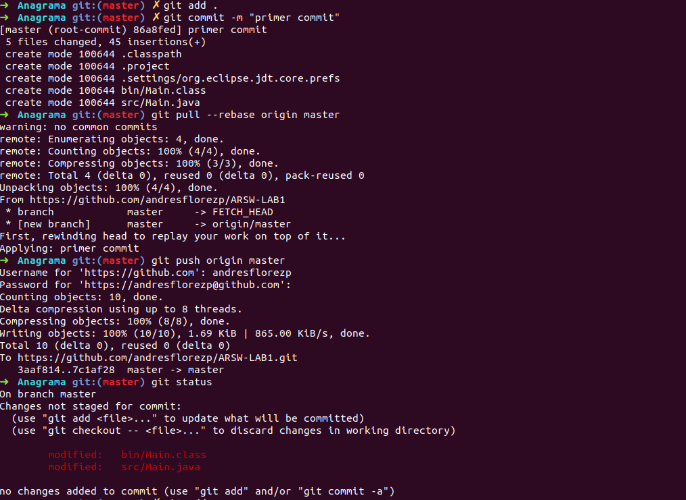

y luego seguimos los pasos mencionados anteriormente.

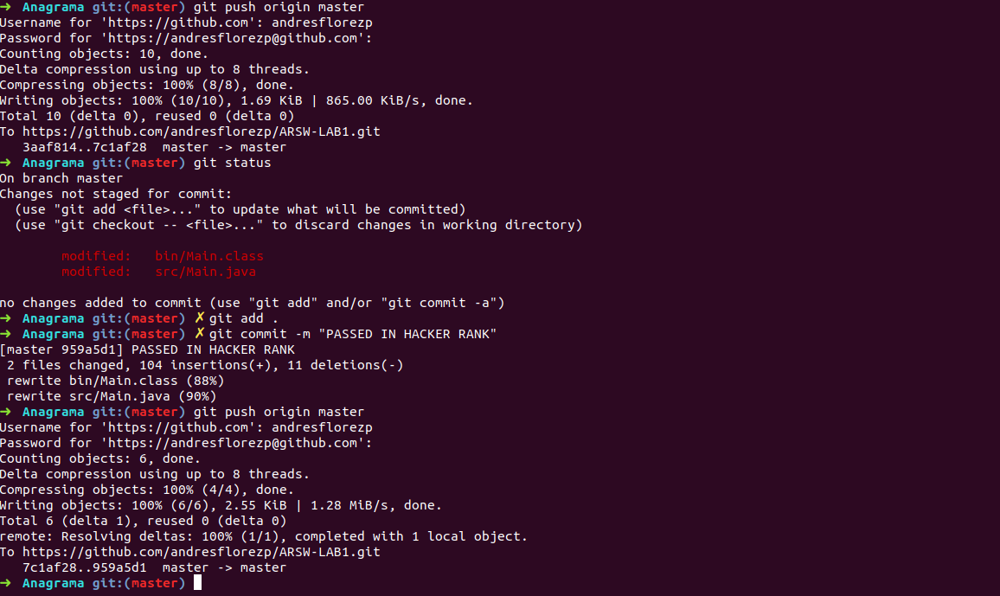

Para el primer problema mostramos que es aceptado.

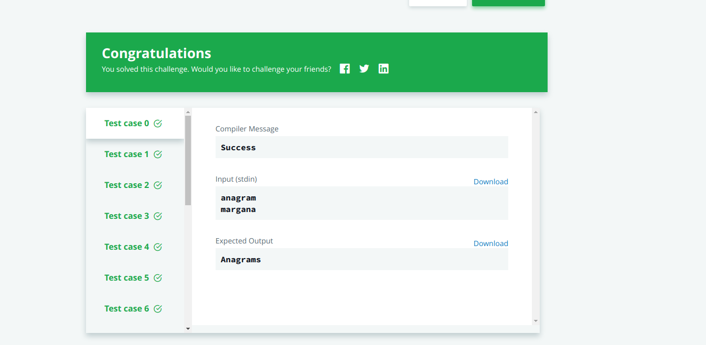

Luego el segundo compañero es decir Juan Nicolas Nontoa Caballero hace los comandos básicos de configuración de git es decir el user,email,remote. 

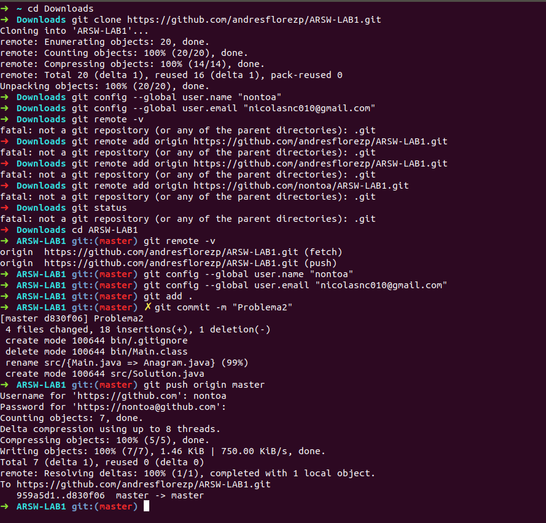

**git pull origin master-→ Permite traer las cosas de la rama** y luego resuelve el problema.

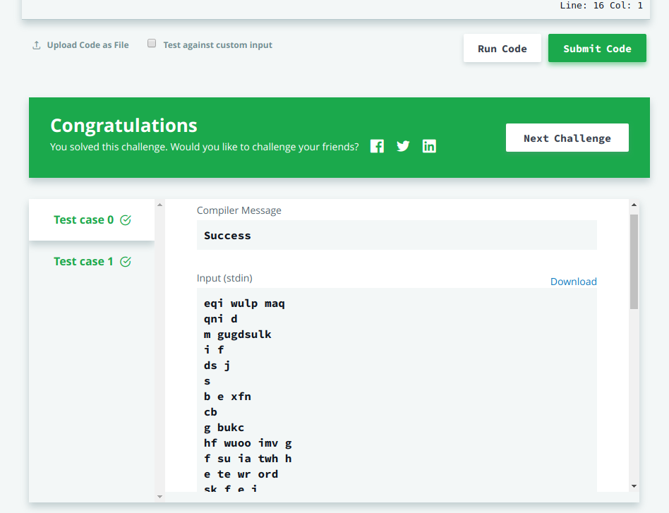

Luego hacemos git pull origin master para traer los cambios y por ultimo subir el reporte al github.

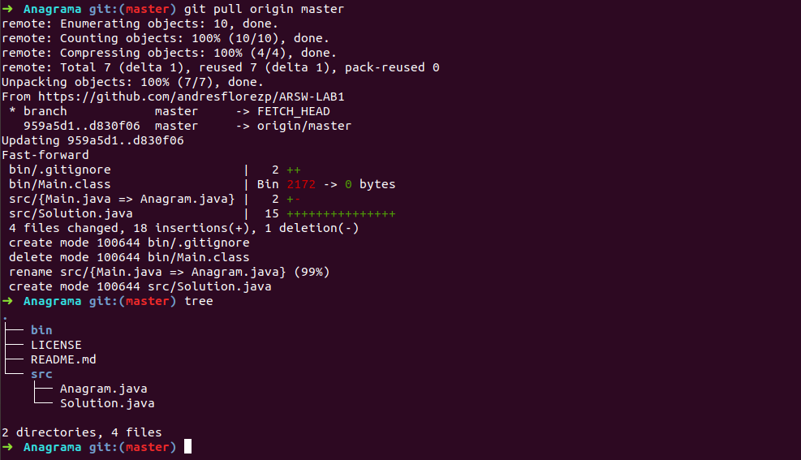

## Parte MAVEN

**mvn archetype:generate -B -DgroupId=edu.eci -DartifactId=file-spy**

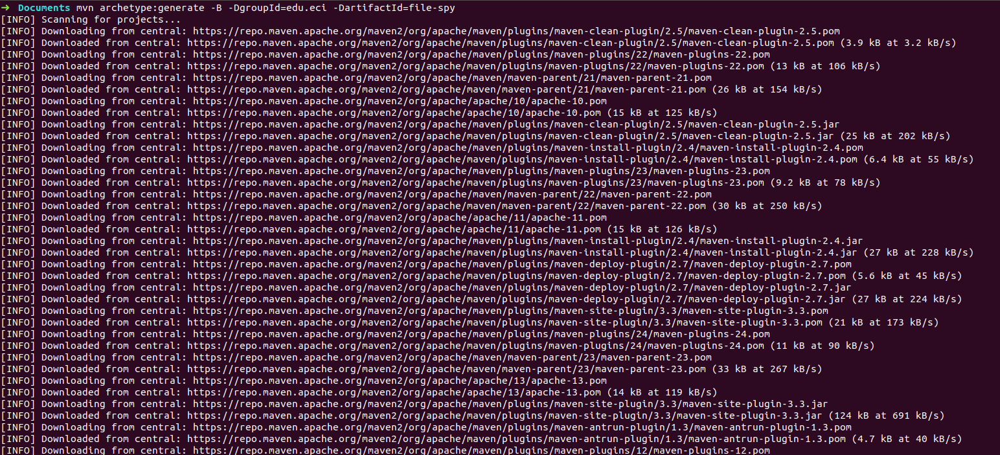

* ¿Qué significa la opción -B en el comando?
       
* ¿Qué significa la opción -D en el comando?

* ¿Qué significa las propiedades groupId, artifactId en el comando?

       groupId es el identificador único de la organización o grupo que crea el proyecto (se podría decir que es el identificador de la aplicación), y artifactId es el identificador único del artefacto principal de este proyecto (se podría decir que es el identificador del módulo dentro de la aplicación), es decir, este será el nombre del jar.

* Describe el contenido del directorio que se ha creado.

       Se creo un proyecto el cual contiene el POM.xml y una carpeta src en la cual tiene dos carpetas, main y test.

* ¿Qué significa la palabra SNAPSHOT en el valor de la versión?

       Al indicar SNAPSHOT se quiere decir que es una versión evolutiva, es decir que estamos trabajando para obtener al versión 1.0.
       
* ¿Cuál es el propósito de la etiqueta de embalaje en el archivo POM?

       Con packaging se indica el tipo de empaquetado que hay que hacer con el proyecto. Podemos usar jar, war, ear, pom.

* ¿Cuál es el propósito de las dependencias y las etiquetas de dependencia en el archivo POM?

       El proposito de los tags es mantener una estructura ordenada y ademas permitir no estar cargando los jar de 
       las librerias sino solo llamarlas cuando uno las necesite.

* Los tres principales ciclos de vida de Maven son clean, default y site. Describe cada uno de ellos.

       Clean Elimina todos los .class y .jar generados. Después de este comando se puede comenzar un compilado desde cero.
 
       Site  Genera un sitio web con la información de nuestro proyecto. Dicha información debe escribirse en el fichero pom.xml y ficheros .apt separados.
 
       Default no existe como comando de maven.

* Utilizando el terminal ejecuta el comando mvn compile. ¿Para qué se usa este comando? ¿Qué son las dependencias transitivas?

       Compila el codigo fuente del proyecto y sigue la fase de tests.
       
 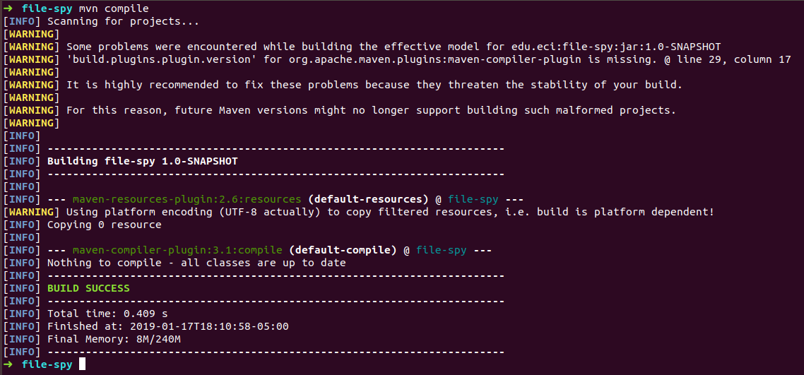

* Utilizando el terminal ejecuta el comando mvn package. ¿Para qué se usa este comando?

       Toma el codigo compilado y empaquetarlo en su formato distribuible, como un JAR.
       

* Utilizando el terminal ejecuta el comando mvn install. ¿Para qué se usa este comando?

       Instalar el paquete en el repositorio local, para su uso como una dependencia en otros proyectos a nivel local.
       
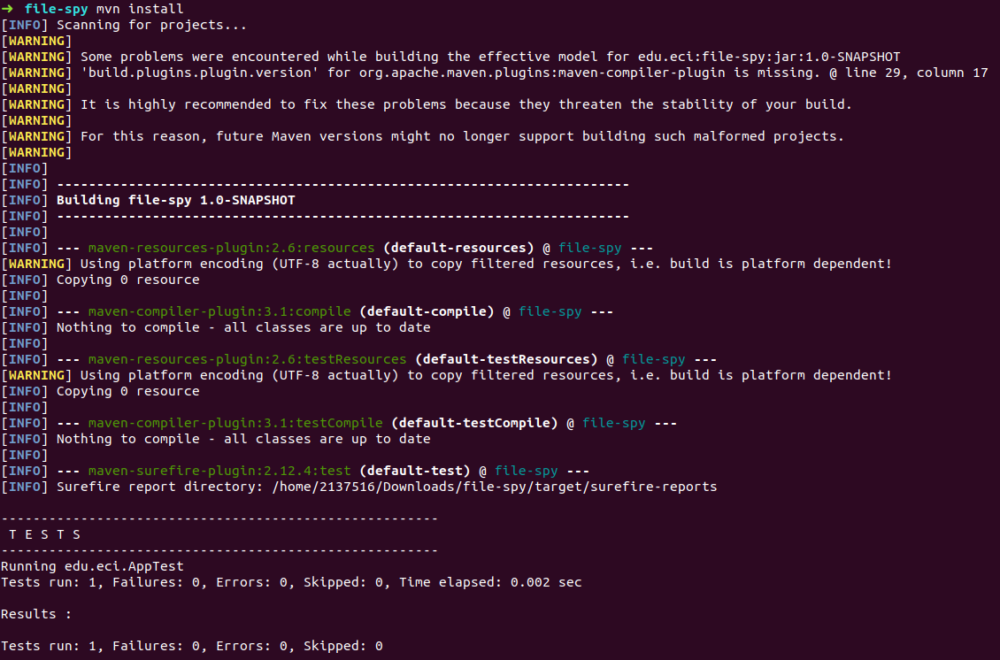

* Generar un nuevo proyecto de Maven en otra carpeta usando las herramientas de la línea de comandos de maven, este proyecto debe tener como id de grupo "edu.eci" y como artifactId "otro proyecto de maven". 

* Reemplace el código de la clase App.java con el siguiente código y realice todos los pasos necesarios para compilar el código.

## Autores

* **Andres Giovanne Florez Perez**  ARSW-LAB1 - [andresflorezp] (https://github.com/andresflorezp)

* **Juan Nicolas Nontoa Caballero**  ARSW-LAB1 - [nontoa] (https://github.com/nontoa)

Consulte también la lista de [colaboradores] (https://github.com/andresflorezp/ARSW-LAB1/graphs/contributors) que participaron en este proyecto.

## licencia

Este proyecto está licenciado bajo la Licencia MIT - vea el archivo [LICENSE](LICENSE) para más detalles.

